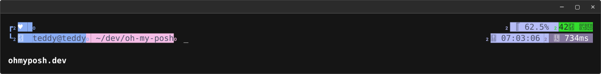
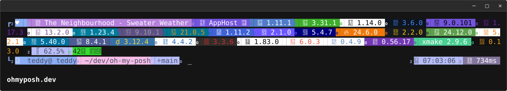
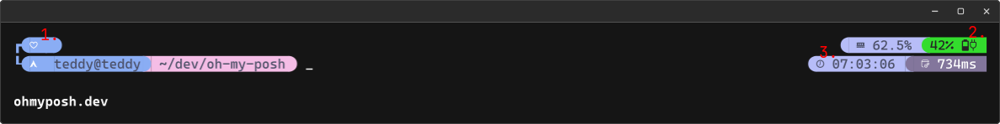

# My Oh My Posh Config

Config was only tested with zsh, some functionality may break on other shells.

For information about setting up oh my posh visit [ohmyposh.dev/docs/installation](https://ohmyposh.dev/docs/installation).

## Preview

### with minimal displayed segments

### with all included segments

## Notable Features

1. Heart is white when logged in as a regular user and red when logged in as root.
2. * Battery icon shows charge state in steps of 10%. 
   * Charging plug icon is shown when device is charging.
   * Background is green when charging, orange when discharging and blue when full.
3. Clock icon is accurate to the current hour of the day.

## Supported Apps/Tools/Languages

* Source Control
  * [git](https://git-scm.com/)
* Music
  * [Spotify](https://www.spotify.com/)
  * [YouTube Music](https://music.youtube.com/) (works with the Youtube Music Desktop App [ytmdesktop](https://github.com/ytmdesktop/ytmdesktop))
  * [LastFM](https://www.last.fm/) (please enter your username and api key in the config)
* Tools
  * [Aspire](https://aspire.dev/)
  * [Cmake](https://github.com/Kitware/CMake)
  * [Xmake](https://xmake.io/)
* Languages
  * [Clojure](https://clojure.org/)
  * [Crystal](https://crystal-lang.org/)
  * [Dart](https://dart.dev/)
  * [.NET](https://dotnet.microsoft.com/)
  * [Elixir](https://elixir-lang.org/)
  * [Fortran](https://fortran-lang.org/)
  * [Go](https://go.dev/)
  * [Haskell](https://www.haskell.org/)
  * [Java](https://www.java.com/)
  * [Julia](https://julialang.org/)
  * [Kotlin](https://kotlinlang.org/)
  * [Lua](https://www.lua.org/)
  * [Mojo](https://docs.modular.com/mojo)
  * [Nim](https://nim-lang.org/)
  * [Node](https://nodejs.org/)
  * [Ocaml](https://ocaml.org/)
  * [Perl](https://www.perl.org/)
  * [PHP](https://www.php.net/)
  * [Python](https://www.python.org/)
  * [R](https://www.r-project.org/)
  * [Ruby](https://www.ruby-lang.org/)
  * [Rust](https://rust-lang.org/)
  * [Swift](https://www.swift.org/)
  * [V](https://vlang.io/)
  * [Vala](https://vala.dev/)
  * [Zig](https://ziglang.org/)